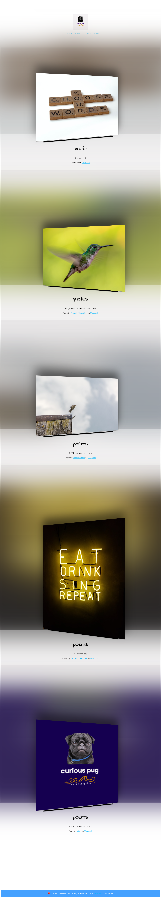

- 👀 curious: human process & performance
- 🌱 interested: python, rust
- 💞️ collaborating: systems that work to create delightful experiences  
___
   
- solutions engineering
- sales
- revenue operations 

___

## Where we are:
  
* Deployed the app on https://hellok.fly.dev/  
### What we're doing  
Fly.io is a simple Docker image built with Go.
### Specifically:
* The app code is a simple Go web server that printed "Hello World"
* The app is containerized into a Docker image called flyio/hellofly 
* The Dockerfile uses a Go builder image to compile the app code and copies the binary into a minimal final image
* The app listens on port 8080 by default
* The app is deployed using flyctl which generates a fly.toml config file
* flyctl handles building the Docker image and deploying it to Fly's infrastructure

### So in summary, the tech stack is:
* Go - for the app code
* Docker - for containerization
* flyctl - for deployment
* Fly.io - for the serverless hosting platform

```flyctl``` is a CLI tool from [Fly.io](http://fly.io)
You can read about it [here](https://fly.io/docs/hands-on/).

## Where we were:
[](2023-11-05-23-08-50.png)  
[](2023-11-05-21-59-08.png)  